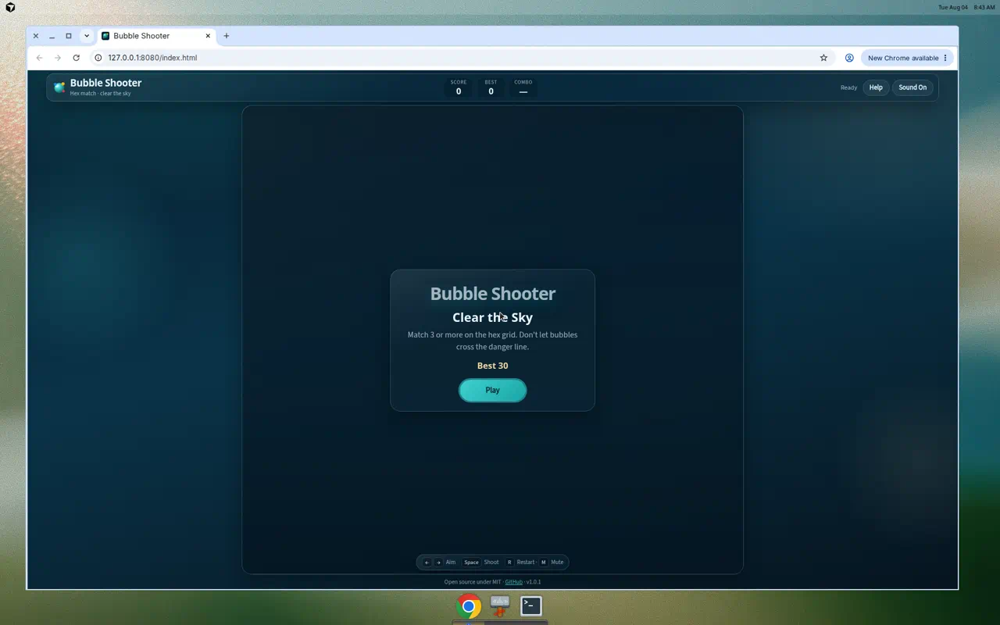
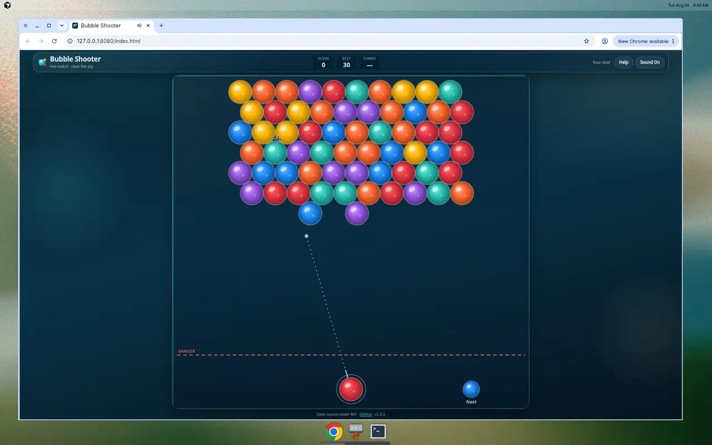

# Bubble Shooter

**A candy-gloss hexagonal Bubble Shooter with Bubble Witch–inspired presentation — pure HTML5, CSS3, and vanilla JavaScript.**

No frameworks. No npm. No bundlers. Open `index.html` and play.

[](https://github.com/lolabest/project/actions/workflows/validate.yml)
[](https://github.com/lolabest/project/actions/workflows/deploy-pages.yml)
[](LICENSE)
[](CHANGELOG.md)

<p align="center">
  
</p>

---

## Features

- Hexagonal board with accurate odd-r neighbor math
- Six glossy bubble colors rendered on canvas
- Continuous collision detection and wall bouncing
- Bubble snapping to attachable hex cells
- Match 3+ clearing with particle bursts
- Floating cluster detection and gravity falls
- Score, combo multiplier, and persistent high score
- Next-bubble preview and aim trajectory
- Win / lose overlays with one-click restart
- Mouse, touch, and full keyboard controls
- **Four in-game skins** (Original, Halloween, New Year, St. Patrick’s Day)
- Synthesized sound effects (Web Audio API)
- Responsive glassmorphism UI with accessibility labels
- `requestAnimationFrame` game loop with delta clamping

## Screenshots

<p align="center">
  
</p>

<p align="center">
  
</p>

## How to Run

### Instant play

1. Clone or download this repository
2. Open `index.html` in a modern browser
3. Click **Play**

### Local static server

```bash
npm run dev
```

Then visit `http://localhost:8080`.

Equivalent without npm:

```bash
python3 -m http.server 8080
```

### Validate the repo

```bash
npm run validate
npm test
```

## Controls

| Action | Desktop | Mobile |
| ------ | ------- | ------ |
| Aim | Mouse move / `←` `→` | Drag on canvas |
| Shoot | Click / `Space` / `Enter` | Release drag |
| Restart | `R` or **Play Again** | **Play Again** |
| Mute | `M` or toolbar button | Toolbar button |
| Help | **Help** button | **Help** button |

## Architecture

Clean, modular responsibilities under a shared `BS` namespace:

```text
InputManager ──▶ Game ──▶ UIManager
                   │
     ┌─────────────┼─────────────┐
     ▼             ▼             ▼
   Board        Shooter     ScoreManager
     │             │             │
CollisionEngine  Bubble     StorageManager
     │
Renderer · AnimationManager · ParticleSystem · SoundManager
```

| Document | Topic |
| -------- | ----- |
| [Architecture](docs/Architecture.md) | Module boundaries and data flow |
| [Game Mechanics](docs/Game-Mechanics.md) | Rules, scoring, win/lose |
| [Rendering](docs/Rendering.md) | Canvas pipeline and VFX |
| [Collision Detection](docs/Collision-Detection.md) | Flight math and snapping |
| [Testing](docs/Testing.md) | Manual checklist and edge cases |
| [Roadmap](docs/Roadmap.md) | Future direction & SemVer |
| [GitHub Community](docs/GitHub-Community.md) | Labels, Discussions, protection |

## Project Structure

```text
.
├── index.html              # App shell
├── style.css               # Design system
├── script.js               # Bootstrap
├── js/                     # Focused game modules
├── assets/icons/           # SVG logo + favicon
├── screenshots/            # README visuals
├── docs/                   # Deep documentation
├── tools/validate.sh       # Zero-dep validator
└── .github/                # CI, issue & PR templates
```

## Tech Stack

- HTML5 semantic shell + accessible dialogs
- CSS3 (glass panels, responsive grid, reduced-motion support)
- Vanilla JavaScript (ES2023) with IIFE modules
- Canvas 2D + Web Audio API

## Versioning

This project follows [Semantic Versioning](https://semver.org/). See
[CHANGELOG.md](CHANGELOG.md) for release history and
[docs/Roadmap.md](docs/Roadmap.md) for the versioning strategy.

## Contributing

Contributions are welcome. Please read:

1. [Code of Conduct](CODE_OF_CONDUCT.md)
2. [Contributing](CONTRIBUTING.md)
3. [Extended Contributing Guide](docs/Contributing-Guide.md)

Enable **GitHub Discussions** for ideas and questions. Use issue forms for bugs
and feature requests. Suggested labels and branch protection settings are listed
in [docs/GitHub-Community.md](docs/GitHub-Community.md).

## Security

Please report vulnerabilities privately as described in [SECURITY.md](SECURITY.md).

## License

Distributed under the [MIT License](LICENSE).

## Credits

- Game design & engineering — [Lola Best](https://github.com/lolabest)
- Inspired by classic puzzle arcade bubble shooters
- Built as an open-source reference for clean HTML5 game architecture

---

<p align="center">
  <strong>Bubble Shooter</strong> · Clear the sky, one hex at a time.
</p>
